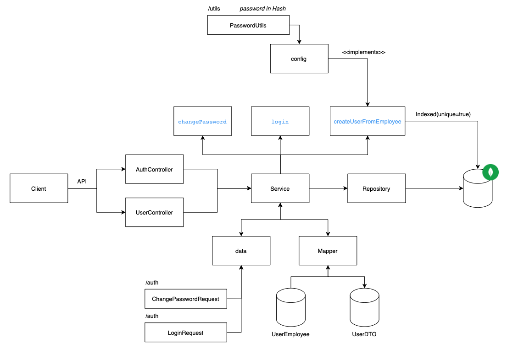

[DEVELOPING]

An small aplication that we can see our location on map

# System
Build in two parts. Front and Backend.

- On front side, we would see a menu where we can specify what we would like to see (Finance Report, CheckIn/CheckOut of an employee). On CheckIn and CheckOut parts we would see where on the map we are right now!

- On the other hand, on the back side, we would see all the business rules of our program.

# Architecture
<i>developing</i>

## Employee
<i>developing</i>

## Employee

## Users

# Models
<i>developing</i>

